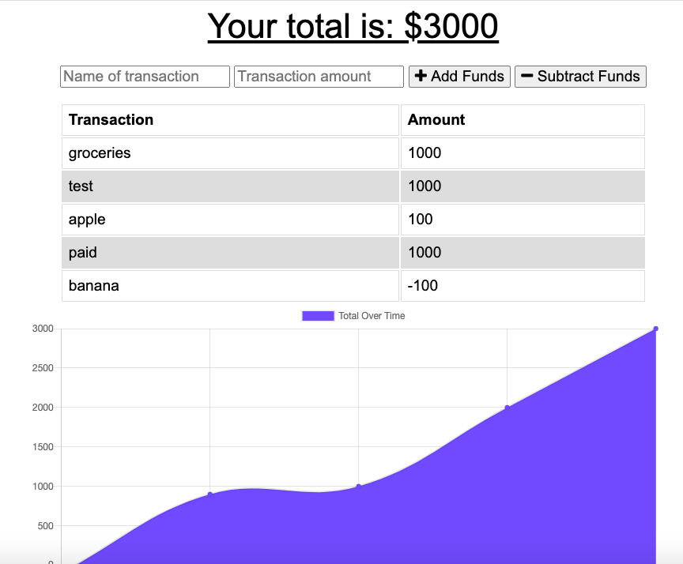

# Budget Tracker

  

  ## Description
  
  This application is a budget tracker where the user can store all his expenses online and offline, using the cache and service worker on the client to keep all the modification made by the user.

  ## Table of contents
  
  * [Installation](#installation)
  * [Usage](#usage)
  * [License](#license)
  * [Contributing](#contributing)
  * [Questions](#questions)
  

  ## Installation
  
 To install this application is necessary to run the command "npm install" on the terminal. Also, this application is deployed on Heroku. To accesses, the application [click here](https://salty-plains-90121.herokuapp.com/). 

  ## Usage

It is possible to add expenses and income online and offline.

Screen shot of application:

  ## License

  This application uses MIT License

  ## Contributing

  ## Questions

  Any other question feel free to contact me on my email fernandes.alvaro@gmail.com or my git hub profile [Github profile](https://github.com/AlvaroFernandes).

